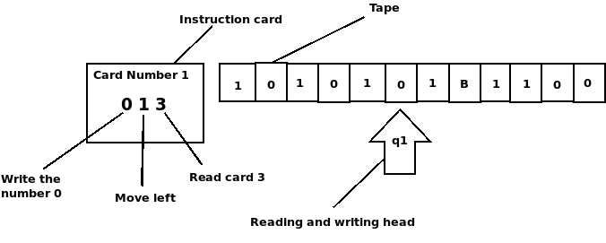
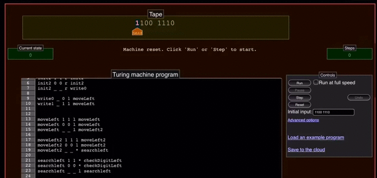

# Turing Machine & Binary Sum

# Contact information
- Gustavo Alfredo Zárate Acosta / gustavoza20@hotmail.com
- Fernando Nateras Bautista / fnaterasb1@gmail.com
- José Vidal Cardona Rosas / vrosas832@gmail.com

# Type of licence
GNU General Public License v3.0

# Resume 
* About the model of Turing Machine, specifically one adaptation for binary sum with Python 3.x

# General Objectives 
* Simulate the Turing Machine
* Understand the Turing Machine

# System Architecture
* A **tape** for the simbols from some alphabet
* A **head** for read and write symbols
* A **stattus record** for store the status of machine
* A **finite table/instructions card** for the instructions to work of machine

# Data Source
* Just we need binary numbers to work (see pruebas.txt file) 

# Test For Data Acquisition
* We can write by ourself binary numbers (see Interperter.py file)
* We can use binary numbers from a .txt file and send to turing machine to sum this numbers (see Interperter_time_steps.py file)

# Software Tools
* Python 3.x
* Matplotlib
* Matplotlib.pyplot

# Description of Turing Machine

 **Turing Machine**: Is building with:
  * A **tape** divided into cells where each cells contains a simbol from some finite alphabet. 
      - The alphabet contains a special symbol called white (here written as 'B') it's like a symbol that tells us that there is no value.
  * A **head** that can read and write symbols on the tape and move the tape left and right one (and only one) cell at a time.
  * A **status record** that stores the status of the Turing machine, one of the finite states. There is a special initial state with which the status log starts.
  * A **finite table** of instructions (occasionally called an action table or transition function).
  
> *for more information, see: [Turing Machine](https://es.wikipedia.org/wiki/M%C3%A1quina_de_Turing)*

## Turing Machine for binary sum working
Our binary numbers is in the tape, and our head will move left or right
depending the instructions in the Card and what detected our head. The Instructions Card contains the 
instructions for behavior of head.
like the next image: 
> 

We can see at the bottom the work instructions from our Turing Machine (see Instructions.txt file) 

