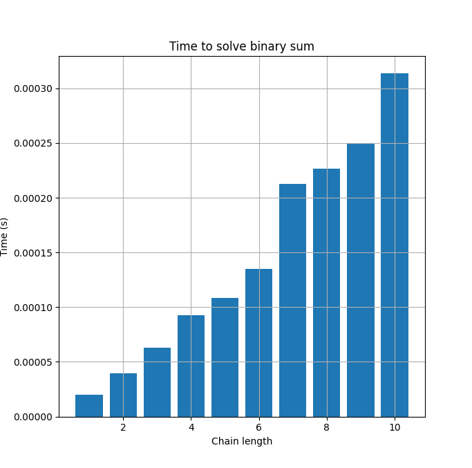

# Turing Machine & Binary Sum

# Contact information
- Gustavo Alfredo Zárate Acosta / gustavoza20@hotmail.com
- Fernando Nateras Bautista / fnaterasb1@gmail.com
- José Vidal Cardona Rosas / vrosas832@gmail.com

# Type of licence
GNU General Public License v3.0

# Resume 
* About the model of Turing Machine, specifically one adaptation for binary sum with Python 3.x

# General Objectives 
* Understand the Turing Machine
* Simulate the Turing Machine
* Implement the binary sum in a Turing Machine 

# System Architecture
* A **tape** for the simbols from some alphabet
* A **head** for read and write symbols
* A **status record** for store the status of machine
* A **finite table/instructions card** for the instructions to work of machine

# Data Source
* We just need two binary numbers to work (see pruebas.txt file) 

# Test For Data Acquisition
* We can write two binary numbers by ourself (see Interperter.py file)
* We can use binary numbers from a .txt file and send to turing machine to sum this numbers (see Interperter_time_steps.py file)

# Software Tools
* Python 3.x
* Matplotlib
* Matplotlib.pyplot

# How to use our code about Turing Machine?
- If you want just sum two numbers, you need to use **Interperter.py**, that's the **main program** with our implementation of Turing Machine
> This program needs to work the file *Instructions.txt*, so, try to don't alterate this file!
- If you want to evaluate time or/and steps, you need to use **Interperter_time_steps.py**, that's an adaptation of our **main program** with our implementation of Turing Machine
> This program read the binary numbers from *pruebas.txt*, there you can put your binary numbers. It's really important how the dictionaries for time and steps are created, because, we save the contain in a two files: *time.txt* and *steps.txt* and **Grafica.py** use this files for generate the graph. 
> Look that, *pruebas.txt* have from one to ten two numbers with length 1, and from eleven to twenty, two numbers with length 2. Thats really important 
because we using the line number when we save the mean in our dictionary. 

# Description of Turing Machine

 **Turing Machine**: Is building with:

  * A **tape** divided into cells where each cells contains a simbol from some finite alphabet. 
      - The alphabet contains a special symbol called white (here written as 'B') it's like a symbol that tells us that there is no value.

  * A **head** that can read and write symbols on the tape and move the tape left and right one (and only one) cell at a time.

  * A **status record** that stores the status of the Turing machine, one of the finite states. There is a special initial state with which the status log starts.

  * A **finite table** of instructions (occasionally called an action table or transition function).
  
> *for more information, see: [Turing Machine](https://es.wikipedia.org/wiki/M%C3%A1quina_de_Turing)*

## Turing Machine for binary sum working
Our binary numbers is in the tape, and our head will move left or right
depending the instructions in the Card and what detected our head. The Instructions Card contains the 
instructions for behavior of head.
like the next image: 
> 

We can see at the bottom the work instructions from our Turing Machine (see Instructions.txt file).
The instructions are composed as follows:

  * **init2 1 1 r** -> **Status Read Write Movement** (It can be r=right, l=left, *=stop)

  * Some instructions have a fifth simbols, like: **init2 1 1 r init2** The fifth symbol corresponds to a reference to the following instruction.

  * The simbol **_** represents a blank space
  
  * The machine halts when it reaches the instruction 'halt-accept'
  
  ## About our time tests and number of steps 
  - We write ten numbers with length equals one, ten numbers with length equals two ... we write ten numbers with length equals ten. 
  We used ten numbers because when we running our program for get the time data and steps data. So, we used ten numbers for get the mean 
  of time and steps. With this way we obtain certainty about the time that we spend for sum two binary numbers with length equals *n* and
  how many steps we need to sum two binary numbers with length equals *n*. Where *n* is the length of our two binary numbers. 
 
 > In the following graphs we can see the results of our experimentation:
 ### Time
 
 > As we can see, in the case of time. We have a considerable change in 7-digit and 10-digit chains.
 Maybe is not relevant because just we get +-8 microsegs. But maybe is really relevant with length chains like 100-digits or more. 
 ### Steps
 
 > In the case of steps, we can see that is proportional to the length chains. If we have chains with more
 length, the number of steps increase. 
